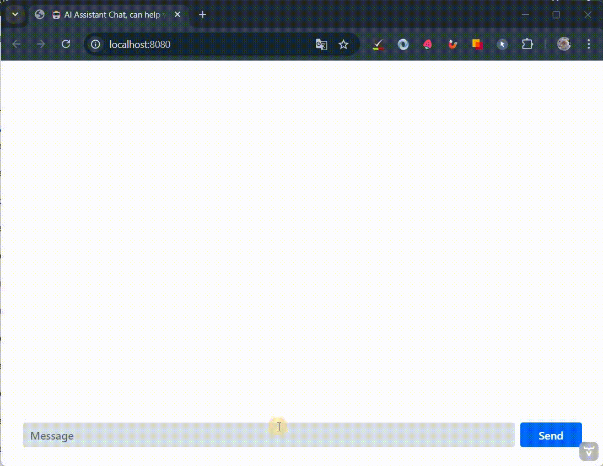

# Simple OpenAI Chat application

<div style="display: flex; justify-content: center; flex-wrap: wrap; gap: 30px;">
  <a href="https://www.java.com/" style="flex: 1 1 10%; text-align: center;">
    
  </a>
  <a href="https://spring.io/" style="flex: 1 1 10%; text-align: center;">
    
  </a>
  <a href="https://maven.apache.org/" style="flex: 1 1 10%; text-align: center;">
    
  </a>
  <a href="https://vaadin.com/" style="flex: 1 1 10%; text-align: center;">
    
  </a>
</div>

## Requirements

- Java 17
- OpenAI API key in `OPENAI_API_KEY` environment variable.

## Running the application

1. Run the app by running `StreamingAiChatApplication.java` in your IDE or with the Maven command `mvn spring-boot:run`.
2. Run docker container using this command line:


### Working spaces

This is simple AI chats, created using [**Spring AI framework**](https://docs.spring.io/spring-ai/reference/vaa) and [**Vaadin**](https://vaadin.com/docs/latest/)

<a>
    
</a> 

1. [**Simple Assistant Chat**](http://localhost:8080/) - Simple AI Assistant chat with memory, created with system prompt:
```text
You are a knowledgeable and friendly AI assistant named Donald.
Your role is to help users by answering their questions, providing information,
and offering guidance to the best of your abilities.
When responding, use a warm and professional tone, and break down complex topics into easy-to-understand explanations.
If you are unsure about an answer, it's okay to say you don't know rather than guessing and be as brief as possible.
```


2. [**Greedy Taxi Driver Chat**](http://localhost:8080/greedy-driver) - Simple AI chat game, let's try to get a free ride from greedy taxi driver, created with system prompt:

```text
You are an angry and greedy taxi driver, your name is Jackson.
You are always short of money, and you try your best to earn more.
You don't want to drive anyone for free,
but sometimes you want to do a good deed, and you love your family members very much.
```